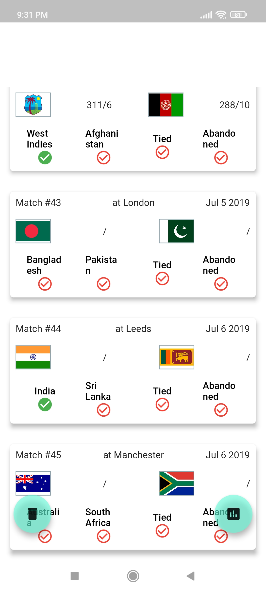
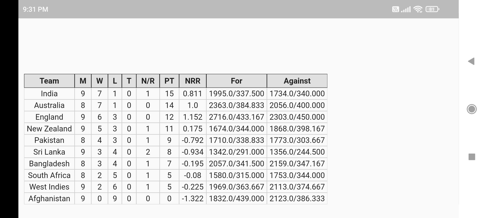

# cwc2019_point_simulator

Cricket World Cup 2019 Point Simulator app made in June, 2019. This code has been written in June, 2019 and was compile against "sdk: ">=2.1.0 <3.0.0".
The code has not been migrated to latest Flutter/Dart versions.

#Screenshots

        </img>
        
        </img>

